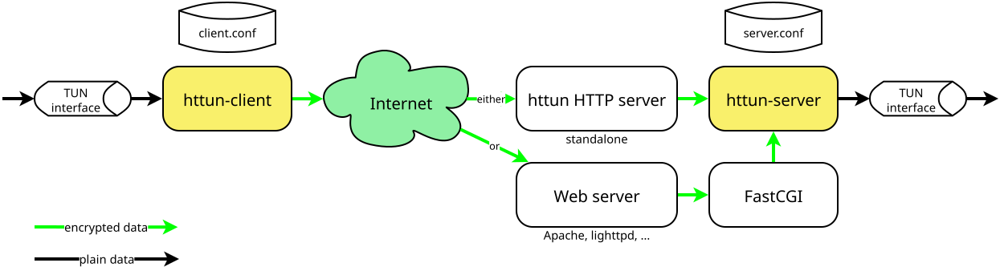

# Encrypted HTTP tunnel for IP4/6 or layer-7 network traffic

httun is a network tunneling tool for tunneling arbitrary network traffic over HTTP(s).

The tunnel is always strongly encrypted and authenticated.

## Why?

Some public "internet" access points only allow access to certain ports and protocols.

HTTP almost certainly is one of the allowed protocols.

If you only have access to one of these limited access points you can use your httun server to tunnel to the real internet with all services available that you enable in your server routing/firewall.

## What kind of traffic can be tunneled?

1. IP v4 and IP v6 traffic can be tunneled.
   In this case the endpoints are Linux TUN endpoints on both the client machine and the server machine.
   Normal Linux configuration, routing and filtering tools are used to integrate the TUN endpoints into your network structure.
2. Simple socket traffic (ISO/OSI layer 7) can be also tunneled.
   In this case a local socket is opened by the client software.
   It listens on one given port locally for incoming traffic.
   This traffic and a target machine address/port tuple is then tunneled to the server machine where a socket is opened to the target machine.

The tunnelling option 1. is preferred, because it's much more flexible.
But it's also much harder to set up due to the need to configure and route the traffic to and from the Linux TUN endpoints.
Standard Linux routing (ip route) and filtering (nftables / iptables) can be used.

The tunnelling option 2. has the downside that it is restricted to a single port and that it basically pokes a hole through your server firewall.
Therefore, use it with care.
httun provides some server side block- and allow-list based filtering to mitigate this risk.
But it has the advantage that it's easier to set up.

This powerful tool comes with great benefits if used correctly and it comes with risks if used incorrectly.
Like with any other tunnelling/VPN tool.
Please read the httun documentation to understand both the potential and the risk of httun tunnelling.

## Block diagram

## Security

For more information about security and reporting vulnerabilities, please see the [security documentation](SECURITY.md).

## Performance

The performance overhead of tunnelling traffic over HTTP is big, of course.
HTTP is a verbose protocol with large headers.
httun tries to minimize the header sizes where possible, but of course it can't control them all.

However, the performance of httun is still pretty good.

It highly depends on what your application traffic looks like.
If the application sends mainly only small packets, then this will result in a rather large overhead.
But if the application can send large packages then the overhead of the HTTP headers and the httun headers is quite small compared to the application payload.

Throughput of more than 10 MBit/s is possible.
But it depends on your application what throughput you can actually get.

Latency is also much increased, as compared to direct network connections.
Expect a latency overhead of at least 10 ms.

## The server - Either FCGI or Standalone

The server can be run

1. as FCGI server together with Apache, lighttpd or any other HTTP web server which supports the FCGI protocol.
2. as a very simple standalone HTTP server that does not require other real web server software to be run on the server side.

This gives you the full flexibility to either

1. plug httun into your existing Apache/lighttpd/etc infrastructure and serve a httun tunnel from an arbitrary URL path of your existing setup or
2. run httun standalone with no web server overhead.

# Installing

See the [installation instructions](doc/INSTALL.md) for more information about how to build and install httun.

# Examples

If you want to set up an IP TUN tunnel, see the [TUN example](doc/EXAMPLE_TUN.md).

IF you want to use a layer 7 socket based tunnel, see the [L7 example](doc/EXAMPLE_L7.md).

# Configuring

See the [configuration documentation](doc/CONFIGURATION.md) for detailled information about how to configure the httun server and client.

# Distribution packaging

If you want to package the software for distribution, please see the [distribution packaging hints](doc/DISTRO_PACKAGING.md).

# License

Copyright (c) 2025 Michael Büsch <m@bues.ch>

Licensed under the Apache License version 2.0 or the MIT license, at your option.
